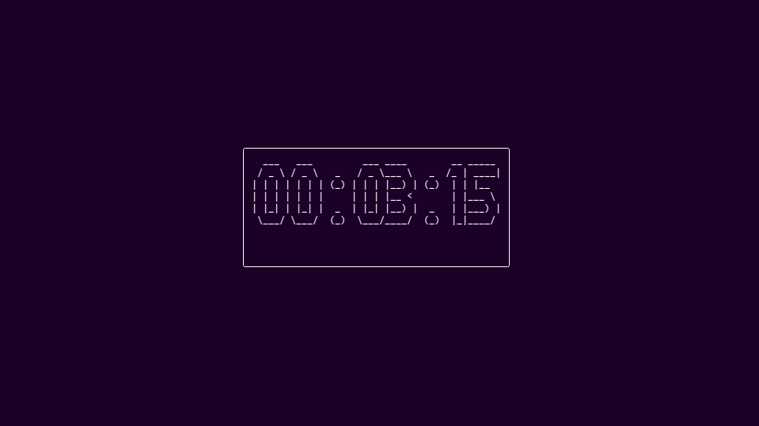

# tTime 🍵

> **A fully customizable, sci-fi style countdown timer for your terminal.**

`tTime` brings big ASCII art numbers, smooth animations, and audio alerts directly to your command line. Perfect for coding sprints, tea brewing, or orbital launch sequences.



## ✨ Features

*   **Big ASCII Art Display:** Powered by `pyfiglet` for readable, scalable text.
*   **Live Updates:** Smooth, center-aligned TUI using `rich`.
*   **Audio Alerts:** Plays a beep sound when the timer hits zero.
*   **Visual Alarm:** Flashes the screen red and white when time is up.
*   **Fully Customizable:** Change fonts, text colors, and border styles on the fly.


## 📦 Installation

You can install `tTime` directly from the release wheel or build it from source.

### From Release
Download the `.whl` file from the [Releases page](../../releases) and run:

```bash
pip install ttime-1.0.0-py3-none-any.whl
```

### From Source
Clone the repository and install:

```bash
git clone https://github.com/Techsmith404/ttime.git
cd ttime
pip install .
```

## 🚀 Usage

Run the timer with the `ttime` command.

**Basic 5-minute timer:**
```bash
ttime -M 5
```

**1 hour, 30 minutes, and 10 seconds:**
```bash
ttime -H 1 -M 30 -S 10
```

### Customization

Make it look how you want!

**Matrix Style (Green text, Green border, Digital font):**
```bash
ttime -M 10 -fc "bold green" -bc "green" -f "digital"
```

**Cyberpunk Style (Cyan text, Magenta border, Slant font):**
```bash
ttime -S 45 -fc "bold cyan" -bc "bold magenta" -f "slant"
```

### Command Options

| Argument | Flag | Description | Default |
| :--- | :--- | :--- | :--- |
| **Hours** | `-H` | Hours to count down | `0` |
| **Minutes** | `-M` | Minutes to count down | `0` |
| **Seconds** | `-S` | Seconds to count down | `0` |
| **Font** | `-f` | Font style (e.g., `big`, `slant`, `block`) | `big` |
| **Font Color** | `-fc` | Color of the text (e.g., `red`, `bold blue`) | `white` |
| **Border Color** | `-bc` | Color of the panel border | `white` |

---

*Built with ❤️ using Python, Rich, and Pyfiglet.*